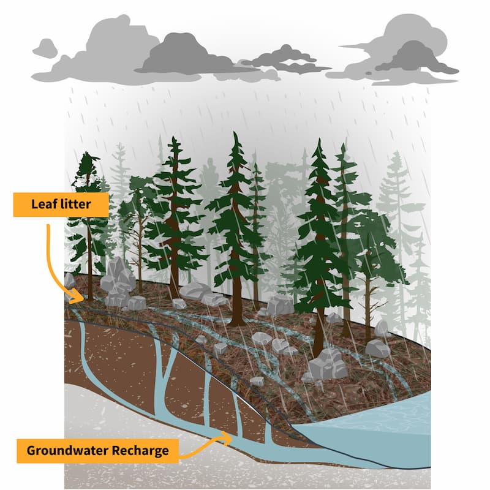
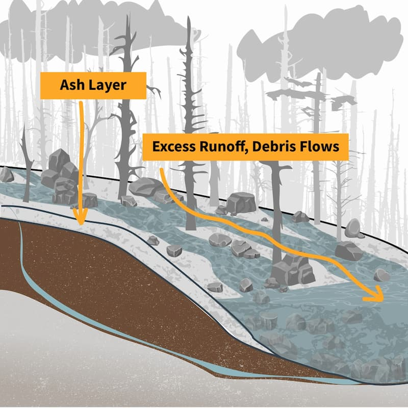

# How Wildfires Threaten U.S. Water Supplies

> _A newer version of the software may be available. See https://code.usgs.gov/wma/vizlab/fire-hydro/-/releases to view all releases._

This repo uses Vue 3, Vite, and D3.js to build a data visualization website about the impacts of wildfires on water supplies in the western United States. It features interactive maps of wildfire perimeters from 1984 to present, diagrams of watershed impacts, and guidance for water providers on adapting to post-fire conditions.

**The data visualization website can be viewed at [https://water.usgs.gov/vizlab/fire-hydro](https://water.usgs.gov/vizlab/fire-hydro).**

## Building the website locally

Clone the repo. In the directory, run `npm install` to install the required modules. Once the dependencies have been installed, run `npm run dev` to run locally from your browser.

To build the website locally you'll need `node.js` `v20` and `npm` `v10` or higher installed. To manage multiple versions of `npm`, you may [try using `nvm`](https://betterprogramming.pub/how-to-change-node-js-version-between-projects-using-nvm-3ad2416bda7e).

## Data pipeline

The R `targets` pipeline fetches, processes, and exports fire perimeter and watershed data for the Vue app.

### Prerequisites

- R 4.4+ with packages: `targets`, `sf`, `rmapshaper`, `tidyverse`, `units`, `arcgislayers`, `tigris`, `terra`, `elevatr`, `geotargets`
- `mapshaper` CLI (for SVG export): `npm install -g mapshaper`

### Running the pipeline

```r
targets::tar_make()
```

### Pipeline structure

| Phase | File | Description |
|-------|------|-------------|
| Fetch | `01_fetch.R` | Downloads data from MTBS, WFIGS, USFS, Census |
| Process | `02_process.R` | Cleans, dissolves by year, simplifies geometry |
| Visualize | `03_visualize.R` | Exports SVG layers for the interactive map |

### Data sources

| Source | Coverage | Used for |
|--------|----------|----------|
| [MTBS Burned Area Boundaries](https://mtbs.gov) | 1984–present, complete through 2023 | Fire perimeters for 1984–2023 (≥1000 acres) |
| [WFIGS Interagency Perimeters](https://services3.arcgis.com/T4QMspbfLg3qTGWY/arcgis/rest/services/WFIGS_Interagency_Perimeters/FeatureServer/0) | 2020–present | Fire perimeters for 2024–2025 |
| [USFS Forest to Faucets 2.0](https://apps.fs.usda.gov/arcx/rest/services/EDW/EDW_ForeststoFaucets_02/MapServer) | Static | Important water supply watersheds |
| [US Census (tigris)](https://www.census.gov/geographies/mapping-files/time-series/geo/cartographic-boundary.html) | Static | State boundaries |

WFIGS coverage begins in 2020, not 2016 — the service returns no records for
2016–2019. Operational perimeters for those years live in GeoMAC and NIFC's
`InteragencyFirePerimeterHistory`, the latter of which stopped being populated
after 2019 and is not usable as a current source.

### Mixing two perimeter sources

The published series splices two datasets, set by `mtbs_complete_through` and
`wfigs_display_years` in `02_process.R`. They measure different things — MTBS
maps satellite burned-area extent, WFIGS records operational fire-line
perimeters — so this is a real methodological break, not just a change of
provider. It is defensible because the two agree closely where they overlap
(within roughly 7% on annual acreage for 2020–2023), but the boundary is worth
surfacing to readers rather than hiding. The `source` column travels through to
`fire_timeseries.csv` so the front end can mark which years came from where.

WFIGS is filtered to wildfires of at least 1,000 acres, matching MTBS's
effective mapping floor. Without that filter WFIGS would contribute thousands
of small fires MTBS never records, and fire counts would jump discontinuously
at the seam. WFIGS also carries both daily-progression and final perimeters for
the same incident, so records are unioned per incident-year rather than
deduplicated by picking one — see `process_wfigs_fires()`.

### Data completeness

MTBS maps fire seasons retrospectively and releases quarterly (February, May,
August, November), so recent years are incomplete until their mapping finishes.
`02_process/out/fire_coverage.csv` compares MTBS against WFIGS for each year so
the cutoff can be re-judged.

Read the `mtbs_pct_of_wfigs` column: values near 100 mean MTBS has finished that
season, and a large shortfall means it has not. WFIGS is current within days of
a fire, which is what makes it a usable yardstick. Exact agreement is not
expected, and small departures either way are normal.

This replaced an earlier check that compared each year's fire count against the
historical median. That test could not tell a quiet fire season from an unmapped
one, and it got 2023 wrong — 2023 ran 71% of the median and looked incomplete,
but WFIGS reports the same acreage for that year, so it was simply a light
season in the West and was being withheld despite being finished.

### Annual update

The fetch targets are `format = "file"` and will not re-download on their own,
so a re-run alone will not pick up new data from a live source.

1. Invalidate the fetch targets so they re-download:
   `targets::tar_invalidate(c(p1_mtbs_gpkg, p1_wfigs_gpkg))`
2. Run `targets::tar_make()` in R
3. Review `02_process/out/fire_coverage.csv` and the QAQC map at
   `03_visualize/out/qaqc_fire_by_year.png`
4. Add the season that just ended to `wfigs_display_years` in `02_process.R`.
   Leave the current calendar year out — a partial season draws a misleadingly
   short bar on the chart.
5. If a year's `mtbs_pct_of_wfigs` has climbed to roughly 100, MTBS has caught
   up: bump `mtbs_complete_through` past it and drop it from
   `wfigs_display_years` so it ships from MTBS instead
6. Re-run, then `npm run build-prod` and deploy

## Citation

Nell, C., Corson-Dosch, H., Bechtel, E. 2020. How Wildfires Threaten U.S. Water Supplies. U.S. Geological Survey software release. Reston, VA.

## Consulting subject matter experts

Brian Ebel, Deborah Martin, and Sheila Murphy consulted on the development of this website as subject matter experts.

## Diagrams

The before/after fire watershed diagrams are free to use.

### Before Fire


### After Fire


## Additional information

* We welcome contributions from the community. See the [guidelines for contributing](https://github.com/DOI-USGS/fire-hydro/) to this repository on GitHub.
* [Disclaimer](https://github.com/DOI-USGS/fire-hydro/blob/main/DISCLAIMER.md)
* [License](https://github.com/DOI-USGS/fire-hydro/blob/main/LICENSE.md)
